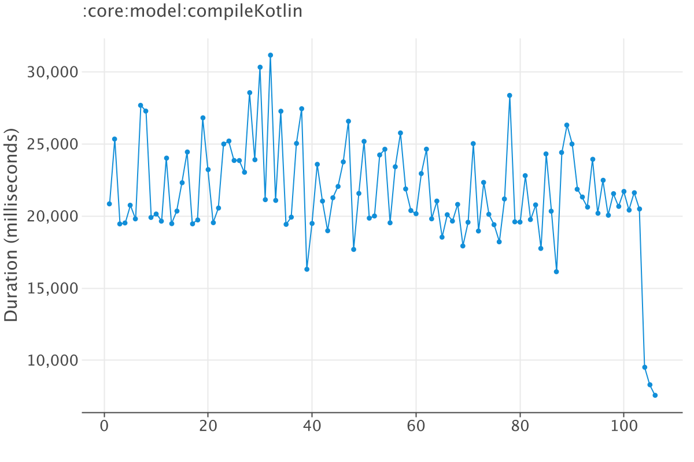

## TaskReport
TaskReport is a CLI tool retrieving task information based on the Gradle Enterprise API.
Reports provided:
### General Report
Includes:
* Top 5 tasks by path duration by task outcome
* Top 5 tasks by path fingerprinting duration by task outcome
* Top 5 tasks by type duration by task outcome
* Top 5 tasks by type fingerprinting duration by task outcome
* Csv files(by path and by type) including task information like
  * Outcome execution
  * Mean and percentiles by outcome and task duration
  * Mean and percentiles by outcome and fingerprinting duration

Example report output:
```
───────────────────────────────────────────────────────────────────────────────────────────────────────────────────────────────────────────────────
│                                                                    Executed                                                                     │
├───────────────────────────────────────────────────────────────────────────────┬─────────────────────────────────────────────────────────────────┤
│                                     Mean                                      │                               P90                               │
├──────────────────────────────────────────────────────────────────┬────────────┼────────────────────────────────────────────────────┬────────────┤
│ Task                                                             │ Duration   │ Task                                               │ Duration   │
├──────────────────────────────────────────────────────────────────┼────────────┼────────────────────────────────────────────────────┼────────────┤
│ :kotlin-stdlib-js:compileKotlin2Js                               │ 1m 18.655s │ :kotlin-gradle-plugin:compileCommonKotlin          │ 2m 57.951s │
├──────────────────────────────────────────────────────────────────┼────────────┼────────────────────────────────────────────────────┼────────────┤
│ :kotlin-gradle-plugin:compileCommonKotlin                        │ 1m 17.511s │ :kotlin-stdlib-js:compileKotlin2Js                 │ 2m 51.189s │
├──────────────────────────────────────────────────────────────────┼────────────┼────────────────────────────────────────────────────┼────────────┤
│ :kotlin-stdlib-js-ir:compileKotlinJs                             │ 1m 13.542s │ :kotlin-stdlib-js-ir:compileKotlinJs               │ 2m 43.194s │
├──────────────────────────────────────────────────────────────────┼────────────┼────────────────────────────────────────────────────┼────────────┤
│ :kotlin-stdlib-wasm:compileKotlinWasm                            │ 1m 10.604s │ :kotlin-stdlib-wasm:compileKotlinWasm              │ 2m 38.919s │
├──────────────────────────────────────────────────────────────────┼────────────┼────────────────────────────────────────────────────┼────────────┤
│ :kotlin-stdlib:compileKotlin                                     │  1m 10.55s │ :kotlin-stdlib:compileKotlin                       │ 2m 37.056s │
└──────────────────────────────────────────────────────────────────┴────────────┴────────────────────────────────────────────────────┴────────────┘
```
Example csv file output:
```
task,module,executions,outcome_executed,outcome_up_to_date,outcome_from_cache,outcome_from_cache_local,outcome_from_cache_remote,duration_executed_mean,duration_executed_p25,duration_executed_p50,duration_executed_75,duration_executed_p90,duration_executed_p99,duration_up_to_date_mean,duration_up_to_date_p25,duration_up_to_date_p50,duration_up_to_date_75,duration_up_to_date_p90,duration_up_to_date_p99,durations_from_cache_mean,durations_from_cache_p25,durations_from_cache_p50,durations_from_cache_75,durations_from_cache_p90,durations_from_cache_p99,durations_from_cache_local_mean,durations_from_cache_local_p25,durations_from_cache_local_p50,durations_from_cache_local_75,durations_from_cache_local_p90,durations_from_cache_local_p99,durations_from_cache_local_mean,durations_from_cache_local_p25,durations_from_cache_local_p50,durations_from_cache_local_75,durations_from_cache_local_p90,durations_from_cache_local_p99,fingerprinting_executed_mean,fingerprinting_executed_p25,fingerprinting_executed_p50,fingerprinting_executed_75,fingerprinting_executed_p90,fingerprinting_executed_p99,fingerprinting_up_to_date_mean,fingerprinting_up_to_date_p25,fingerprinting_up_to_date_p50,fingerprinting_up_to_date_75,fingerprinting_up_to_date_p90,fingerprinting_up_to_date_p99,fingerprinting_from_cache_mean,fingerprinting_from_cache_p25,fingerprinting_from_cache_p50,fingerprinting_from_cache_75,fingerprinting_from_cache_p90,fingerprinting_from_cache_p99,fingerprinting_from_cache_local_mean,fingerprinting_from_cache_local_p25,fingerprinting_from_cache_local_p50,fingerprinting_from_cache_local_75,fingerprinting_from_cache_local_p90,fingerprinting_from_cache_local_p99,fingerprinting_from_cache_remote_mean,fingerprinting_from_cache_remote_p25,fingerprinting_from_cache_remote_p50,fingerprinting_from_cache_remote_75,fingerprinting_from_cache_remote_p90,fingerprinting_from_cache_remote_p99
:gradle-settings-conventions:build-cache:generateExternalPluginSpecBuilders,:gradle-settings-conventions:build-cache,24,12,8,4,4,0,1394,0.0,1120.0,2668.0,3296.5,3681.0,5,0.0,0.0,11.0,18.5,25.0,9,0.0,0.0,0.0,57.0,62.0,9,0.0,0.0,0.0,57.0,62.0,0,0.0,0.0,0.0,0.0,0.0,611,0.0,0.0,1761.0,1892.5,1917.0,2,0.0,0.0,0.0,12.0,18.0,3,0.0,0.0,0.0,19.0,22.0,3,0.0,0.0,0.0,19.0,22.0,0,0.0,0.0,0.0,0.0,0.0
:gradle-settings-conventions:build-cache:extractPrecompiledScriptPluginPlugins,:gradle-settings-conventions:build-cache,24,12,8,4,4,0,7,0.0,3.0,12.0,22.0,27.0,0,0.0,0.0,0.0,1.5,2.0,0,0.0,0.0,0.0,3.0,10.0,0,0.0,0.0,0.0,3.0,10.0,0,0.0,0.0,0.0,0.0,0.0,0,0.0,0.0,1.0,2.5,5.0,0,0.0,0.0,0.0,0.5,1.0,0,0.0,0.0,0.0,1.0,1.0,0,0.0,0.0,0.0,1.0,1.0,0,0.0,0.0,0.0,0.0,0.0
```

TaskReport works only with Gradle Builds.

### Single Task Report
Includes:
* Duration of the task when is executed
* Task information by cache outcome
* Graph image with the task duration
* Csv file with the task duration

Example report output:
```
┌──────────────────────────────────────┐
│       Task Cache State Report        │
├──────────────────────────────────────┤
│ assemble > :core:model:compileKotlin │
├──────────────────────────────────────┤
│              tags: [ci]              │
├─────────────────────────────┬────────┤
│ executed_cacheable          │    578 │
├─────────────────────────────┼────────┤
│ avoided_from_local_cache    │   2824 │
└─────────────────────────────┴────────┘
┌───────────────────────────────────────────────────────────────────────────────┐
│                  Task Duration Report with outcome executed                   │
├───────────────────────────────────────────────────────────────────────────────┤
│                     assemble > :core:model:compileKotlin                      │
├───────────────────────────────────────────────────────────────────────────────┤
│                                  tags: [ci]                                   │
├────────┬────────┬────────────┬────────────┬─────────┬────────────┬────────────┤
│ Builds │  Mean  │    P25     │    P50     │   P75   │    P90     │    P99     │
├────────┼────────┼────────────┼────────────┼─────────┼────────────┼────────────┤
│  578   │ 18.83s │ 15.907250s │ 18.909500s │ 21.013s │ 24.315300s │ 28.400870s │
└────────┴────────┴────────────┴────────────┴─────────┴────────────┴────────────┘

```
Example image output:


Example csv output file output:
```
BuildId,Date,Duration
7111xk22z57ay,1683179400735,20849
59566565xx3j4,1683179441258,25344
12kj21kj21jk6,1683179884655,19457
rxhc0a9jq101e,1683179936085,19525
3232kl32ss2l2,1683179949069,20756
kkajjwq2isdis,1683179951921,19808
wqklqwlkqwlkq,1683179958387,27682
```
Single Task Report supports Gradle builds
## Usage

#### Get Binary
```
curl -L https://github.com/cdsap/TaskReport/releases/download/v.0.2.3/taskreport --output taskreport
```

#### Update Permissions
```
chmod 0757 taskreport
```

#### Example General Report
```
./taskreport -api-key=$GE_KEY --url=$GE_URL --max-builds=10000 --project=kotlin --requested-task=install --tags=ci
```
#### Example Single Task Report
```
./taskreport -api-key=$GE_KEY --url=$GE_URL --max-builds=20000 --project=nowinandroid --requested-task=assemble --task-path=:core:model:compileKotlin --tags=ci
```

## Parameters
### General Report
Required parameters:
* `api-key` Gradle Enterprise API token
* `url` Gradle Enterprise instance
* `project` Project where the build is executed
* `requested-task` Requested task of the build
* `tags` tags used in the build

### Single Task Report
Required parameters:
* `api-key` Gradle Enterprise API token
* `url` Gradle Enterprise instance
* `project` Project where the build is executed
* `requested-task` Requested task of the build
* `task-path` Task path under investigation
* `tags` tags used in the build
* `single-task` flag required to specify single task execution

### Complete list of parameters

| Name                  | Description                                | Default | Required | Example                               |
|-----------------------|--------------------------------------------|---------|----------|---------------------------------------|
| api-key               | String token                               |         | Yes      | --api-key=$GE_KEY                     |
| url                   | Gradle Enterprise instance                 |         | Yes      | --url=https://ge.acme.dev             |
| project               | Root project in Gradle Enterprise          |         | Yes      | --project=acme                        |
| requested-task        | Requested task in the build                |         | Yes      | --requested-task=assemble             |
| task-path             | Task complete path                         |         | No       | --task-path=:core:model:compileKotlin |
| tags                  | Tags used in the build scans to process    | empty   | Yes      | --tags=ci --tags=linux                |
| max-builds            | Max builds to be processed                 | 1000    | No       | --max-builds=2000                     |
| since-build-id        | Starting build to apply the reverse search | null    | No       | --since-build-id=cqiqsDqa2m7cw        |
| include-failed-builds | Include failing builds                     | true    | No       | --include-failed-builds               |
| single-task           | Single task flag report                    | false   | No       | --single-task                         |
| exclusive-tags        | All tags matches with the builds required  | true    | No       | --exclusive-tags                      |


## Building from Source
If you don't want to use the binary provided, you can build the binary from source:
```
./gradlew install
cd build/install/taskreport/bin
./taskreport -api-key=$GE_KEY --url=$GE_URL --max-builds=20000 --project=nowinandroid --requested-task=assemble --task-path=:core:model:compileKotlin --tags=ci
```

## Examples Reports
General Report
https://github.com/cdsap/TaskReport/actions/runs/5440258231/jobs/9893010951#step:4:10157

Single Task Report
https://github.com/cdsap/TaskReport/actions/runs/5440258231/jobs/9893010951#step:4:5073

## Compatibility
We have tested final binary with Java 8, 11 and 17 environments.

## Libraries used
* picnic
* ge-data-api
* fatBinary
* clikt
* lets-plot-kotlin
